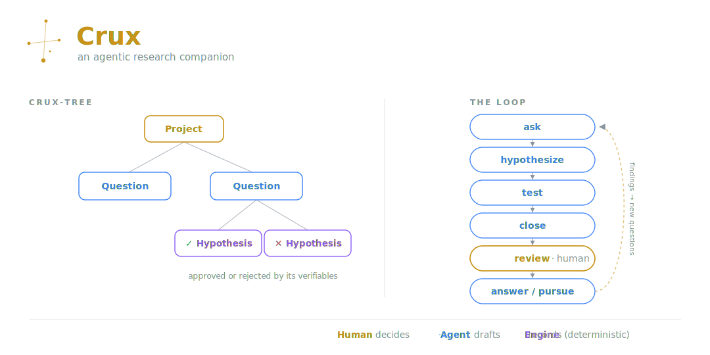
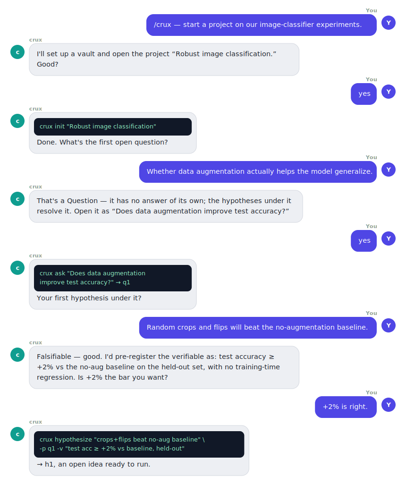

# Crux

**An agentic research companion** — a scientific-method lab notebook your LLM agent drives.

> *Crux* (the Southern Cross) is the sky's smallest constellation and its most reliable signpost — for centuries it's how navigators found their bearings. `crux` does the same for a research program: it keeps you oriented through a growing tree of open questions and the hypotheses that resolve them, and helps you get to the **crux** of each one.

<p align="center">
  
</p>

## What it is

`crux` organizes a research program the way the scientific method actually works:

- **Questions** — what you don't know. They carry no answer of their own; they're resolved by aggregating the findings beneath them. Questions nest.
- **Hypotheses** — falsifiable, testable leaves under a question, each with **pre-registered verifiables** and **findings**. The only things actually tested.
- A deterministic **engine** does the bookkeeping — IDs, the parent tree, validators, the evidence-ledger roll-up, a human **review gate**, and regenerating a navigable `META.md` map + `EXPERIMENTS.md` registry.
- An **LLM agent** drives it conversationally; **you (the PI)** make the judgment calls — which questions matter, the verifiable bar, and when a question is truly answered.

Everything is plain markdown in an **Obsidian-graphable vault**: open it and the question/hypothesis tree *is* the graph.

## Install

As an agent skill (Claude Code and other [skills.sh](https://www.skills.sh)-compatible agents):

```bash
npx skills add mehdiforoozandeh/crux
```

Or clone and use the engine directly (Python 3, stdlib only — no dependencies):

```bash
git clone https://github.com/mehdiforoozandeh/crux
python crux/scaffold/crux.py --help
```

## Setting up in your project

Once the skill is installed, just tell your agent to **set up crux in your repo**. It runs
a short interview — *you only think about the science* — and stands up the vault for you:

- **Have a proposal, notes, or a draft paper?** Point the agent at it; it drafts your setup from it.
- **Already have a working repo** (code, results, months of work)? It reads it and *migrates*
  it into an organized crux-tree — reconstructing what was asked, tested, and found. It only
  ever writes under `crux/` and never touches your existing files.
- **Nothing written down yet?** It figures the project out with you, one question at a time.

Either way it drafts one **seed outline**, you approve it, and the engine materializes the
whole notebook atomically. The seed shows both a fresh hypothesis and a migrated (already-run) one:

```
- Project: CANDI — self-supervised epigenome imputation
  - Q: Can JEPA improve CANDI?
    - H: JEPA pretraining beats supervised init            # fresh — an idea to run
      - v: imputation Spearman ≥ +0.01 vs baseline
    - H: [tested] contrastive aux loss lifts peak AUROC    # migrated — already-run work
      - v: [x] peak AUROC ≥ +0.02 (found: 0.71 → 0.74)
      - finding: net win on peaks.
```
```bash
crux init --from seed.md --dir crux
```

crux is **human-in-charge by default**: the agent drafts, runs, and reports, but *you* approve
before an experiment runs and before any verdict is recorded. Full seed-spec reference in
[`scaffold/README.md`](scaffold/README.md).

## A minute with crux

You drive crux by **talking to your agent**. You describe the science; it proposes the concrete
node and a falsifiable bar; you approve; it runs the engine. You never memorize verbs. Here a
researcher opens a question and designs the first hypothesis:

<p align="center">
  
</p>

The verdict is **mechanical**: `crux close` reads the verifiable checkboxes (`[x]` met · `[ ]` unmet · `[-]` n/a) and derives `supported` / `partial` / `refuted` / `inconclusive`. The engine never reads your run logs — you supply the per-box judgment and a headline metric. That keeps it domain-agnostic. Running an experiment and recording a verdict are always **your** call — crux is human-in-charge by default.

## How it's built

- `SKILL.md` — the PI ⇄ Agent ⇄ Engine playbook the LLM follows.
- `scaffold/` — the engine: `crux.py` (CLI), `engine.py`, `render.py`, `templates/`, `selftest.py`. See [`scaffold/README.md`](scaffold/README.md) for the full CLI reference.

Validate the install end-to-end (no GPU/tokens/SLURM):

```bash
python scaffold/selftest.py            # builds a dummy vault, asserts every invariant
python scaffold/selftest.py --keep ./v # …and keep it to open in Obsidian
```

## Roadmap

`crux` is the home for a small constellation of agentic-research tools. Planned siblings under the same roof: **era** (whole-program search toward a score) and **autoresearch** (autonomous experiment loops), with a GUI later.

## License

[MIT](LICENSE) © Mehdi Foroozandeh
