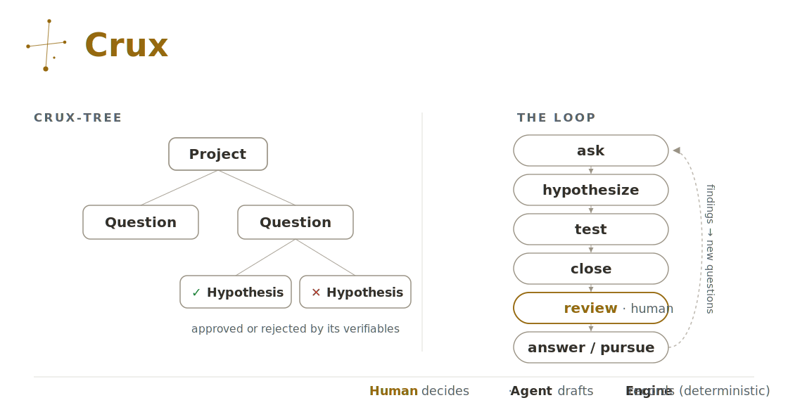
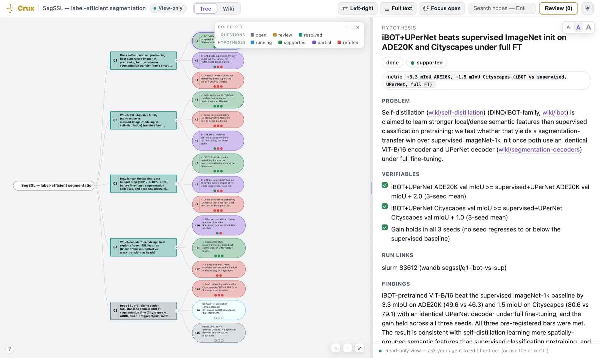
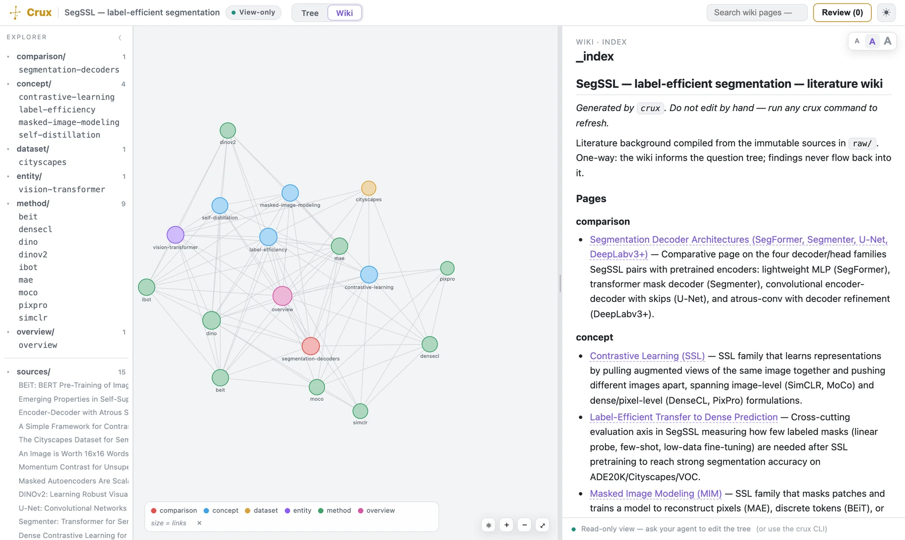

# Crux

**A scientific-method lab notebook your AI agent drives.** `crux` keeps a falsifiable
**question → hypothesis → evidence** tree for your research project — so nothing gets
silently p-hacked or forgotten across dozens of experiments. The agent runs the loop;
**you make the calls.**

## What it is

<p align="center">
  <picture>
    <source media="(prefers-color-scheme: dark)" srcset="assets/crux-schematic-dark.svg">
    
  </picture>
</p>

<p align="center"><sub><em>The model.</em> A Project holds Questions; Questions hold falsifiable Hypotheses, resolved through the ask → hypothesize → test → close → review → answer loop. Green ✓ / red ✗ mark met / unmet — the same reading as the status-colored cockpit below.</sub></p>

Months into a project, can you still say exactly what you asked, what you tested, and whether
each question is actually settled? `crux` makes that explicit and keeps it that way — organizing
a research program the way the scientific method actually works:

- **Questions** — what you don't know. They carry no answer of their own; they're resolved by aggregating the findings beneath them. Questions nest.
- **Hypotheses** — falsifiable, testable leaves under a question. Each carries **pre-registered verifiables** — the concrete pass/fail checks you write down *before* running (like *"ADE20K val mIoU ≥ supervised + 2.0, 3-seed mean"*) — plus its **findings**. Hypotheses are the only things actually tested.
- A plain-Python **engine** does the bookkeeping so you don't: it assigns IDs, keeps the tree consistent, tallies the evidence upward, pauses at a human **review gate** for your sign-off before anything counts as final, and regenerates a navigable `META.md` map + `EXPERIMENTS.md` registry.
- An **LLM agent** drives it conversationally; **you (the PI)** make the judgment calls — which questions matter, the verifiable bar, and when a question is truly answered.

For example: you ask *"Does SSL pretraining beat supervised ImageNet init?"*; crux pins a hypothesis
with a bar you set in advance (*"ADE20K mIoU ≥ supervised + 2.0"*); your agent runs it and reports
back; **you** sign off on the verdict. Nothing counts until you do.

## Install

Requirements: Python ≥ 3.8 (stdlib only) and `git`; the `npx` path also needs Node.js.
(Fresh macOS: `xcode-select --install` provides git.)

`crux` is four skills under [`skills/`](skills) — `crux` (the engine + lab-notebook
skill), `crux-wiki` (literature wiki), `crux-cockpit` (GUI launcher), and `evolve-crux`
(contributing to crux). Install them all with any
[skills.sh](https://www.skills.sh)-compatible agent — Claude Code, Cursor, Codex,
Windsurf, Copilot CLI, and others:

```bash
npx skills add mehdiforoozandeh/crux --all
```

`--all` selects all four skills — without it, a picker opens with none pre-selected, and
`crux-wiki` / `crux-cockpit` need the `crux` skill installed beside them. This installs
into the current project; add `-g` to install user-wide instead. How you *invoke* a skill
varies by agent — Claude Code picks them up automatically, Cursor exposes them as `/crux`,
Windsurf as `@crux`, Codex via `/skills`. A project-scope install also drops agent dirs
into your repo (`.agents/`, `.claude/`, `skills-lock.json`, for some agents a non-hidden
`agent/` folder) — commit them deliberately or `.gitignore` them.

Or clone and run the installer — it symlinks all four skills into your agent's skills
dirs (`~/.claude/skills` for Claude Code and `~/.agents/skills`, shared by Cursor, Codex,
Windsurf, and Copilot CLI; set `SKILLS_DIR` to target somewhere else):

```bash
git clone https://github.com/mehdiforoozandeh/crux
cd crux && ./install.sh
```

Keep the clone in place — the skills are symlinks into it — and restart / reload your
agent after installing either way. **Updating:** clone path, `git pull` (the symlinks
stay live); npx path, `npx skills update` (installs are a copy, frozen at install time).
**Uninstalling:** delete the four symlinks, or `npx skills remove`.

The engine is Python 3, stdlib only — no dependencies. From a clone, run it with the
root-level wrapper: `./crux --help` (it forwards to `skills/crux/scaffold/crux.py`), and
check the install with `./crux selftest` — the engine's full test suite, no GPU or tokens.

## Try it in 60 seconds

No agent, no dependencies, nothing to configure — open the cockpit over the bundled
example vault right from a fresh clone:

```bash
git clone https://github.com/mehdiforoozandeh/crux
cd crux && ./crux serve --dir skills/crux/examples/segssl_vault
```

That's the [segssl_vault](skills/crux/examples/segssl_vault) example (**5 questions,
15 hypotheses** — the vault behind the screenshots below): pan the status-colored tree,
open a hypothesis's evidence ledger, and flip to the **Wiki** tab for the literature
graph. (Port taken? Pin one with `--port 8890`.) When you're ready to run your own
program, install the skills above and tell your agent to set up crux in your repo.

## Why not just a doc, Notion, or W&B?

Those hold notes, a graph, and run logs. crux adds the part they don't:

| Your current setup | What crux adds on top |
|---|---|
| **Obsidian / Notion** — notes + a link graph | a **question → hypothesis** structure the engine keeps consistent, and rolls findings up automatically |
| **A spreadsheet / lab notebook** | **pass/fail bars you lock in _before_ the run**, and a **mechanical verdict** derived from them — no post-hoc goalpost-moving |
| **W&B / MLflow** — run logs & metrics | a human **review gate** and evidence roll-up across many parallel hypotheses; crux sits **beside** your tracker, not on top of it |

It's all plain markdown that only ever writes under `cruxvault/` — non-destructive,
Obsidian-compatible, and it can migrate a repo you already have.

## The cockpit

Your vault is plain markdown you can open in **Obsidian** — but crux has its own purpose-built
home for it. Run **`crux serve`** for a dependency-free, **read-only** browser **cockpit**:
pan / zoom / search the live, status-colored tree, watch the review gate, and read each node's
evidence ledger. It's a viewer, so every edit still goes through your agent or the `crux` CLI —
Obsidian stays available for hands-on editing.

<p align="center">
  <picture>
    <source media="(prefers-color-scheme: dark)" srcset="assets/screens/cockpit-tree-dark.webp">
    
  </picture>
</p>

<p align="center"><sub>The <b>cockpit</b> over the <a href="skills/crux/examples/segssl_vault">segssl_vault</a> example — the status-colored tree (branches collapse/expand) and a hypothesis's <b>evidence ledger</b> (verifiables · metric · run link · finding). Read-only; every edit goes through your agent or the <code>crux</code> CLI. <em>(Real screenshot; it matches your GitHub light/dark theme.)</em></sub></p>

It also gives the **literature wiki** its own view — one Obsidian can't. The `crux-wiki` skill —
inspired by [Karpathy's LLM-wiki idea](https://gist.github.com/karpathy/442a6bf555914893e9891c11519de94f)
(immutable curated sources an agent compiles into interlinked pages) — compiles PI-curated sources
into a knowledge base; the cockpit draws it as a graph **colored by literature category, sized by
links, and cross-linked into the live question tree**, with a one-way literature → wiki → tree flow.
That's structure Obsidian's undifferentiated graph doesn't capture.

<p align="center">
  <picture>
    <source media="(prefers-color-scheme: dark)" srcset="assets/screens/wiki-graph-dark.webp">
    
  </picture>
</p>

<p align="center"><sub>The <b>literature wiki</b> as crux's own knowledge graph — pages by category, sized by links, cross-linked with the question tree. Compiled by the <code>crux-wiki</code> skill from PI-curated sources.</sub></p>

## Driving crux

The cockpit above **shows**; the agent **drives**. Everything above is the read-only instrument
panel — you watch it. This is the other side of the glass, where the vault actually gets written.
You never edit `cruxvault/` by hand and you never memorize the engine's verbs — you **talk to your
agent** in plain language, it runs the engine, and **you approve**. The cockpit is how you *read*
your program; the agent is how you *fly* it.

**Two ways in.** Tell your agent to **set up crux in your repo**. It runs a short interview —
*you only think about the science* — and stands up the vault one of two ways:

- **New project** — describe the idea (or point it at a proposal, notes, or a draft paper). It asks a few questions, then drafts your first question and a hypothesis or two to run.
- **Migrate an existing repo** — code and results, months of work already on disk? It *reads* them and reconstructs what was **asked, tested, and found** into a crux-tree, pinning already-run hypotheses with the verdicts they earned. It only ever writes under `cruxvault/` and **never touches your files**.

Either way it drafts **one seed outline**, you approve it, and the engine materializes the whole
notebook all at once. The seed carries both a **fresh** hypothesis (an idea to run) and a
**migrated** `[tested]` one (already-run, with its finding):

```
- Project: SegSSL — label-efficient segmentation
  - Q: Does SSL pretraining beat supervised ImageNet init?
    - H: iBOT+UPerNet beats supervised init                       # fresh — an idea to run
      - v: ADE20K val mIoU ≥ supervised + 2.0 (3-seed mean)
    - H: [tested] MAE beats supervised only under full fine-tuning # migrated — already-run work
      - v: [x] ADE20K mIoU ≥ +1.5 (found: +1.8 full-FT; −6.7 linear-probe)
      - finding: partial — wins under full FT, collapses when frozen.
```
```bash
crux init --from seed.md --dir cruxvault
```

That seed grows into a real, months-long program — the [segssl_vault](skills/crux/examples/segssl_vault)
example runs **5 questions and 15 hypotheses** deep, with q5 still open (one running, one an idea).

**The loop.** Day to day it's one rhythm: you ask, the agent proposes a hypothesis with a
**bar locked _before_ the run**, you approve, it runs and reports, you sign off, a verdict lands.

```text
you    Does self-supervised pretraining beat supervised ImageNet init for
       segmentation transfer — same encoder, same decoder, full labels?
crux   That's your open question q1. Pinning one hypothesis under it —
       "iBOT+UPerNet beats supervised init" — and locking the bar before we run:
         • ADE20K val mIoU ≥ supervised + 2.0     (3-seed mean)
         • Cityscapes val mIoU ≥ supervised + 1.0 (3-seed mean)
         • gain holds in all 3 seeds
       Register it as h1?
you    Yes.                        ← sign-off 1 · the bar, before it runs
crux   Kicked off — slurm 83612 (wandb segssl/q1-ibot-vs-sup). h1 is running.
       …
crux   Back: +3.3 mIoU ADE20K (49.6 vs 46.3), +1.5 Cityscapes (80.6 vs 79.1),
       and the gain held across all three seeds. All three bars met. Record it?
you    Signed off.                 ← sign-off 2 · the verdict, before it counts
crux   h1 → supported. iBOT/DINO is now the SegSSL default.
```

You never type the engine yourself, but under the hood that whole exchange is a handful of
commands, here end to end:

```bash
crux ask "Does SSL pretraining beat supervised ImageNet init for segmentation transfer?"  # opens q1
crux hypothesize "iBOT+UPerNet beats supervised init" -p q1 \
     -v "ADE20K val mIoU ≥ supervised + 2.0 (3-seed mean)"                                 # h1, bar locked
crux test h1 --run "slurm 83612 (wandb segssl/q1-ibot-vs-sup)"                             # idea → running
crux close h1 -m "+3.3 mIoU ADE20K, +1.5 mIoU Cityscapes"                                  # verdict from ticked boxes
crux serve                                                                                 # open the read-only cockpit
```

**The verdict is mechanical.** `crux close` reads the verifiable checkboxes (`[x]` met · `[ ]` unmet · `[-]` n/a) and derives `supported` / `partial` / `refuted` / `inconclusive`. The engine **never reads your run logs** — you supply the per-box judgment and a headline metric; the bar itself was fixed before the run, so there's no goalpost left to move. h1 ticked all three and landed **supported**; MAE's migrated h2 met one of three (+1.8 full-FT, −6.7 frozen) → **partial**, not a rounded-up win. And crux keeps the losers — h3's DenseCL came back **refuted** at −1.3 mIoU, recorded so you never re-run a dead end.

The human cost is bounded and predictable: you sign off **twice per hypothesis** — before it runs and before its verdict is recorded — plus once **per question** at the **review gate**, where you choose `answer` or `pursue` (the gate the cockpit's *Review* queue and the schematic's *review · human* step both show). crux sits beside you at the bench, not in the way. Full seed-spec reference in [`skills/crux/scaffold/README.md`](skills/crux/scaffold/README.md).

## License

> *Crux* — the Southern Cross, the sky's most reliable signpost. It keeps you oriented to the **crux** of each question.

[MIT](LICENSE) © Mehdi Foroozandeh
