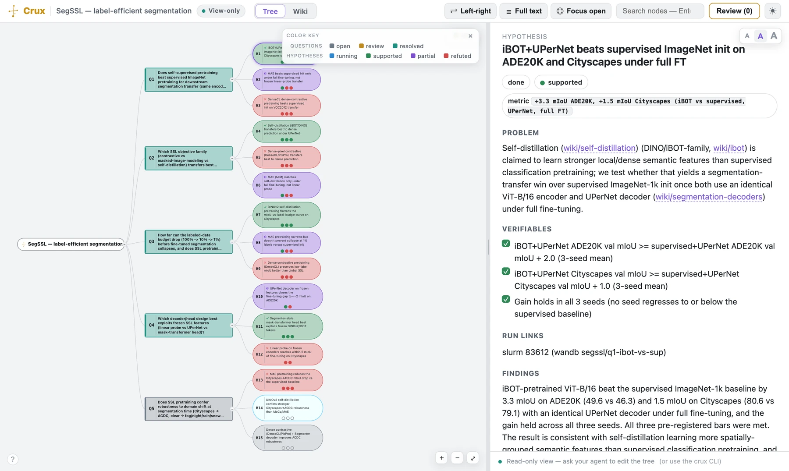
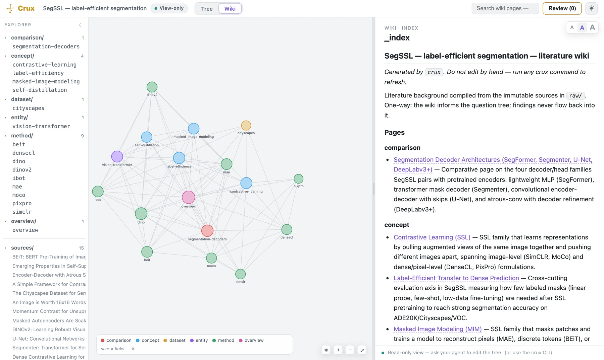

# Crux

**A scientific-method lab notebook your AI agent drives.** `crux` keeps a falsifiable
**question → hypothesis → evidence** tree for your project, so nothing gets silently
p-hacked or forgotten across dozens of experiments. The agent runs the loop;
**you make the calls.**

## What it is

<p align="center">
  
</p>

<p align="center"><sub><em>The model.</em> A Project holds Questions; Questions hold falsifiable Hypotheses, each with verifiables written down <em>before</em> the run — so the verdict is derived from the boxes you set, not argued from the number that came back. You decide what to ask; the agent does the legwork; nothing gets quietly dropped.</sub></p>

Months in, can you still say what you asked, what you tested, and whether each question is
settled? `crux` keeps that explicit:

- **Questions** — what you don't know. They carry no answer of their own; they resolve by aggregating the findings beneath them, and they nest.
- **Hypotheses** — falsifiable leaves under a question, each with **pre-registered verifiables** (pass/fail checks written down *before* running: *"ADE20K val mIoU ≥ supervised + 2.0, 3-seed mean"*), its findings, and the report and figures the run produced. Only hypotheses are tested.
- A plain-Python **engine** does the bookkeeping: IDs, tree consistency, evidence tallied upward, a human **review gate**, a regenerated `META.md` + `EXPERIMENTS.md`.
- An **LLM agent** drives it; **you (the PI)** make the calls — which questions matter, where the bar sits, when a question is answered.

Nothing counts until you sign off.

## Install

Needs Python ≥ 3.8 (the engine is stdlib-only) and `git`; the `npx` path also needs
Node.js. Install all four crux skills with any [skills.sh](https://www.skills.sh)-compatible
agent — Claude Code, Cursor, Codex, Windsurf, Copilot CLI, and others:

```bash
npx skills add mehdiforoozandeh/crux --all
```

Or clone and symlink them into your agent's skills dirs:

```bash
git clone https://github.com/mehdiforoozandeh/crux
cd crux && ./install.sh
```

Restart your agent and you're set — `./crux selftest` checks the install. Scopes,
per-agent notes, updating, and troubleshooting: **[installation guide](INSTALL.md)**.

## Try it in 60 seconds

No agent, no dependencies, nothing to configure — open the cockpit over the bundled
example vault from a fresh clone:

```bash
git clone https://github.com/mehdiforoozandeh/crux
cd crux && ./crux serve --dir skills/crux/examples/segssl_vault
```

That's [segssl_vault](skills/crux/examples/segssl_vault) (**5 questions, 16 hypotheses** —
the vault behind the screenshots below): pan the status-colored tree, open h1's evidence
ledger and its rendered **report with figures**, flip to the **Wiki** tab for the literature
graph. (Port taken? `--port 8890`.)

## Why not just a doc, Notion, or W&B?

Those hold notes, a graph, and run logs. crux adds what they don't:

| Your current setup | What crux adds on top |
|---|---|
| **Obsidian / Notion** — notes + a link graph | a **question → hypothesis** structure the engine keeps consistent, and rolls findings up automatically |
| **A spreadsheet / lab notebook** | **pass/fail bars you lock in _before_ the run**, and a **mechanical verdict** derived from them — no post-hoc goalpost-moving |
| **W&B / MLflow** — run logs & metrics | a human **review gate** and evidence roll-up across many parallel hypotheses; crux sits **beside** your tracker, not on top of it |

It's plain markdown, written only under `cruxvault/` — non-destructive, Obsidian-compatible,
and able to migrate a repo you already have.

## The cockpit

Your vault opens in **Obsidian**, but crux has a purpose-built home for it. **`crux serve`**
is a dependency-free, **read-only** browser **cockpit**: pan / zoom / search the live tree,
focus one question, watch the review gate, read any node's evidence ledger, and open a
hypothesis's **report — rendered markdown, figures and all — beside the tree**. Edits still
go through your agent or the CLI.

<p align="center">
  <picture>
    <source media="(prefers-color-scheme: dark)" srcset="assets/screens/cockpit-tree-dark.webp">
    
  </picture>
</p>

<p align="center"><sub>The <b>cockpit</b> over the <a href="skills/crux/examples/segssl_vault">segssl_vault</a> example — the status-colored tree (branches collapse/expand) and a hypothesis's <b>evidence ledger</b> (verifiables · metric · run link · finding). Read-only; every edit goes through your agent or the <code>crux</code> CLI. <em>(Real screenshot; it matches your GitHub light/dark theme.)</em></sub></p>

The **literature wiki** gets its own view too. The `crux-wiki` skill — inspired by
[Karpathy's LLM-wiki idea](https://gist.github.com/karpathy/442a6bf555914893e9891c11519de94f) —
compiles PI-curated sources into a knowledge base, drawn here as a graph **colored by
category, sized by links, cross-linked into the question tree**, flowing one way:
literature → wiki → tree.

<p align="center">
  <picture>
    <source media="(prefers-color-scheme: dark)" srcset="assets/screens/wiki-graph-dark.webp">
    
  </picture>
</p>

<p align="center"><sub>The <b>literature wiki</b> as crux's own knowledge graph — pages by category, sized by links, cross-linked with the question tree. Compiled by the <code>crux-wiki</code> skill from PI-curated sources.</sub></p>

## Driving crux

The cockpit **shows**; the agent **drives**. You never edit `cruxvault/` by hand or memorize
the engine's verbs — you talk to your agent, it runs the engine, and **you approve**.

**Two ways in.** Tell your agent to set up crux in your repo; a short interview stands up
the vault one of two ways:

- **New project** — describe the idea (or point it at a proposal or draft paper). It drafts your first question and a hypothesis or two.
- **Migrate an existing repo** — months of code and results on disk? It *reads* them and reconstructs what was **asked, tested, and found**, pinning already-run hypotheses with the verdicts they earned. It writes only under `cruxvault/` and **never touches your files**.

Either way you approve **one seed outline** and the engine materializes the whole notebook
at once — here with a **fresh** hypothesis and a **migrated** `[tested]` one:

```
- Project: SegSSL — label-efficient segmentation
  - Q: Does SSL pretraining beat supervised ImageNet init?
    - H: iBOT+UPerNet beats supervised init                       # fresh — an idea to run
      - v: ADE20K val mIoU ≥ supervised + 2.0 (3-seed mean)
    - H: [tested] MAE beats supervised only under full fine-tuning # migrated — already-run work
      - v: [x] ADE20K mIoU ≥ +1.5 (found: +1.8 full-FT; −6.7 linear-probe)
      - finding: partial — wins under full FT, collapses when frozen.
```
```bash
crux init --from seed.md --dir cruxvault
```

That seed grows into a months-long program — [segssl_vault](skills/crux/examples/segssl_vault)
runs **5 questions and 16 hypotheses** deep.

**The loop.** One rhythm: you ask, the agent proposes a hypothesis with a **bar locked
_before_ the run**, you approve, it runs and reports, you sign off, a verdict lands.

```text
you    Does self-supervised pretraining beat supervised ImageNet init for
       segmentation transfer — same encoder, same decoder, full labels?
crux   That's your open question q1. Pinning one hypothesis under it —
       "iBOT+UPerNet beats supervised init" — and locking the bar before we run:
         • ADE20K val mIoU ≥ supervised + 2.0     (3-seed mean)
         • Cityscapes val mIoU ≥ supervised + 1.0 (3-seed mean)
         • gain holds in all 3 seeds
       Register it as h1?
you    Yes.                        ← sign-off 1 · the bar, before it runs
crux   Kicked off — slurm 83612 (wandb segssl/q1-ibot-vs-sup). h1 is running.
       …
crux   Back: +3.3 mIoU ADE20K (49.6 vs 46.3), +1.5 Cityscapes (80.6 vs 79.1),
       and the gain held across all three seeds. All three bars met. Record it?
you    Signed off.                 ← sign-off 2 · the verdict, before it counts
crux   h1 → supported. iBOT/DINO is now the SegSSL default.
```

You never type the engine yourself, but that exchange is a handful of commands end to end:

```bash
crux ask "Does SSL pretraining beat supervised ImageNet init for segmentation transfer?"  # opens q1
crux hypothesize "iBOT+UPerNet beats supervised init" -p q1 \
     -v "ADE20K val mIoU ≥ supervised + 2.0 (3-seed mean)"                                 # h1, bar locked
crux test h1 --run "slurm 83612 (wandb segssl/q1-ibot-vs-sup)"                             # idea → running
crux close h1 -m "+3.3 mIoU ADE20K, +1.5 mIoU Cityscapes"                                  # verdict from ticked boxes
crux serve                                                                                 # open the read-only cockpit
```

**The verdict is mechanical.** `crux close` reads the checkboxes (`[x]` met · `[ ]` unmet ·
`[-]` n/a) and derives `supported` / `partial` / `refuted` / `inconclusive`. The engine
**never reads your run logs**, and the bar was fixed before the run, so there's no goalpost
left to move: h1 ticked all three → **supported**; MAE's h2 met one of three → **partial**,
not a rounded-up win; h3's DenseCL landed **refuted**, recorded so you never re-run a dead
end. What the run produced goes under `## Artifacts` (`results/<id>/`), and `crux validate`
speaks up when results sit on disk with no report linked.

**A question closes on a synthesis, not a status flip.** Once every child is terminal the
question trips the **review gate**: the agent drafts a synthesis, *you* approve it
(`crux approve`), and only then can `crux answer` resolve the question. Two sign-offs per
hypothesis, one per question. Seed spec:
[`skills/crux/scaffold/README.md`](skills/crux/scaffold/README.md).

## License

> *Crux* — the Southern Cross, the sky's most reliable signpost. It keeps you oriented to the **crux** of each question.

[MIT](LICENSE) © Mehdi Foroozandeh
