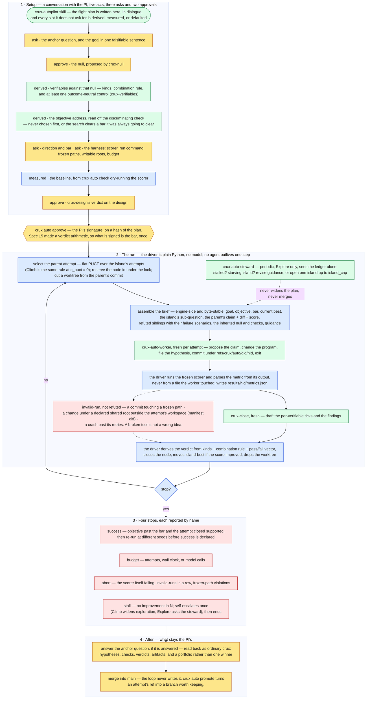

# crux autopilot

Run one anchor question unattended, against a goal and a bar you fix **before** the loop
starts — so a question suited to brute-force search (reproducing a paper's numbers, sweeping
a space, hunting a better method) can be pursued overnight without turn-taking, and read back
in the morning as ordinary crux: questions, hypotheses, verifiables, verdicts, artifacts.

It is not an autonomous scientist. The loop cannot change its objective, its bar, its checks
or its anchor. It searches inside a frame you built.

**Your required acts are three, and none of them is mid-run.**

| when | what |
|---|---|
| before | approve the flight plan — `crux auto approve` |
| after | answer the anchor question, if it is answered |
| after | merge what you want into `main` |

## How a run works

## The parts, in one line each

- **The flight plan** — one file, `auto/<qid>/plan.md`, twenty slots plus a baseline. The
  driver reads only this, so everything the loop does later traces to something you approved.
  The `crux-autopilot` skill writes it with you in five acts; `crux auto check` validates it
  and dry-runs the scorer before anything starts.
- **The objective must come from a check that discriminates against the null.** Optimising a
  bar the hypothesis was always going to clear means the search will clear it, thousands of
  times, at cost, and teach nothing. This is the single most important line in the plan, and
  it is why the skill reads the objective address *off* a check rather than asking you for a
  number first.
- **The driver** is plain Python with no model. It owns selection, budget, id allocation,
  worktrees, launching runs, deriving verdicts and resume. It is the only thing that lives for
  the whole run.
- **The worker** is a fresh agent per attempt, alive for minutes. It sees its brief and nothing
  else, writes code, files the hypothesis and exits — so a four-hour job never holds an agent
  open, and no context anywhere rots.
- **Islands** are sub-questions under the anchor: separate angles, separate worktrees, safe to
  run in parallel. Selection inside an island is flat PUCT; *Climb* is the same rule at
  `c_puct = 0`.
- **The steward** is off by default and Explore-only. It reads the ledger, and may revise the
  guidance or open one more island up to `island_cap`. It can never widen the plan and never
  merges.

## What keeps it honest

- **The scorer is frozen and the driver runs it.** The metric is parsed from the command's
  output, never read from a file the worker last touched.
- **One workspace per attempt, named by its id**, plus a manifest over the declared shared
  roots — path, size, mtime — recorded before the run and re-checked after.
- **A breach closes the attempt `invalid-run`, never `refuted`.** A broken tool is not a wrong
  idea, so the hypothesis stays alive and the record says which happened.
- **A worker may add outcome-neutral controls; it may never add, remove or weaken a
  claim-directed check.** A control can only invalidate a run, so a worker can only ever raise
  its own bar.
- **Success is confirmed at different seeds** before it is declared. A winner's score comes off
  one evaluation, and a lucky seed is the likeliest way an overnight run hands back a false
  result.
- **`main` is never written by the loop.** Attempts live as commits under
  `refs/crux/auto/<qid>/<hid>`; `crux auto promote <hid>` turns one into a branch when you keep
  it.

Sandboxing is your project's job, not crux's: the engine is standard-library-only and
domain-agnostic, so containment belongs in your run command.

## Getting started

Ask for a flight plan in your own words — "set up a flight plan", "I want to search this" —
and the `crux-autopilot` skill takes it from there. It asks you three things, derives or
measures the rest, and stops with a path and the exact `crux auto approve` line. Writing the
plan costs you nothing: the approval stamp covers a hash of the document, so an unapproved
plan is inert and `crux auto run` refuses it.

Watch a run in the cockpit's Autopilot tab (`crux serve`): score against attempt number, what
is in flight per island, the budget axes, and the ledger.

---

Design and rationale, including the alternatives that were rejected and why:
[`.spec/05-autopilot.md`](../../.spec/05-autopilot.md).
