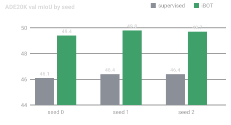

# h1 — iBOT+UPerNet vs. supervised ImageNet init

**Verdict: supported.** All three pre-registered verifiables were met. iBOT-pretrained
ViT-B/16 beats the supervised ImageNet-1k baseline by **+3.3 mIoU** on ADE20K and
**+1.5 mIoU** on Cityscapes under an identical UPerNet decoder and full fine-tuning, and
the gain holds in every seed.

## Setup

| | |
|---|---|
| Encoder | ViT-B/16, 224px, identical weights-shape for both arms |
| Decoder | UPerNet, 512 channels, identical for both arms |
| Pretraining | iBOT 1600ep IN1k · supervised IN1k classification |
| Fine-tuning | 160k iters ADE20K / 80k Cityscapes, AdamW, lr 1e-4, poly decay |
| Seeds | 3 (0, 1, 2), reported as the mean |

## Results

| init | ADE20K val mIoU | Cityscapes val mIoU |
|---|---|---|
| supervised IN1k | 46.3 | 79.1 |
| **iBOT** | **49.6** | **80.6** |
| Δ | **+3.3** | **+1.5** |



Per-seed numbers are in [per-seed.csv](per-seed.csv). The bar that mattered most — *no
seed regresses to or below the baseline* — is the third verifiable, and the worst iBOT
seed (49.4) still clears the best supervised seed (46.4) by 3.0 mIoU.

## Qualitative


Left to right: input, ground truth, iBOT+UPerNet prediction. The recurring difference is
boundary adherence on *thin* structures — poles, sign posts, and the person class — which
is where the supervised arm loses most of its mIoU.

## Reproducing

```bash
python -m segssl.train --init ibot_1600ep --decoder upernet \
    --dataset ade20k --iters 160000 --seed 0
```

> The verifiables were registered before the runs launched (see the hypothesis node); this
> report only records what came back. Nothing here re-derives the verdict — `crux close`
> did that mechanically from the ticked boxes.

## What this does not show

- Frozen-encoder (linear-probe) transfer — that is [[wiki/label-efficiency]] territory and
  was tested separately under q3.
- Robustness under distribution shift; see q5, where MAE's analogous claim was refuted.
